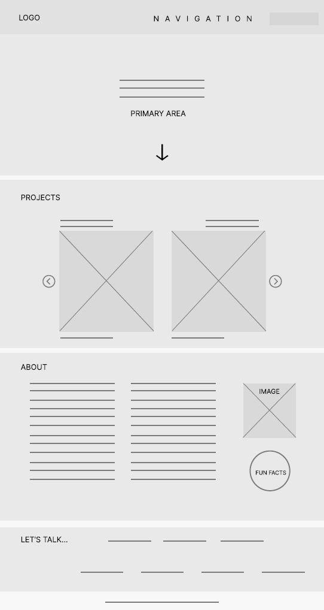
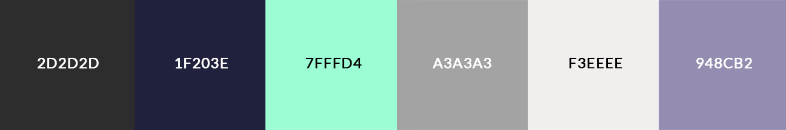
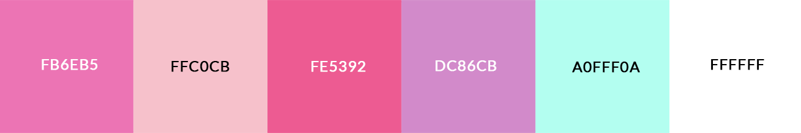
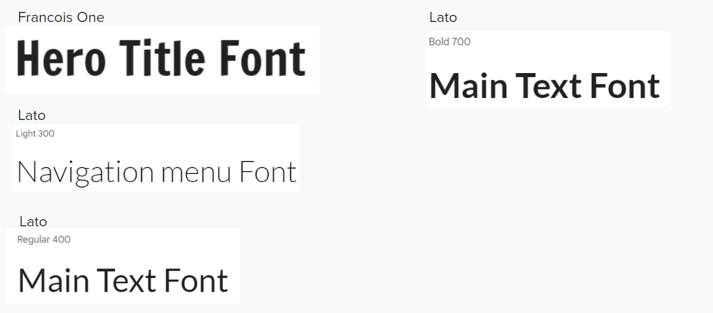
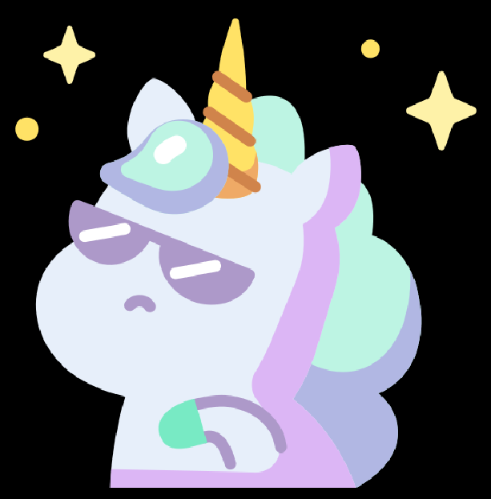

# UI/UX Portfolio

  

This website is my professional UI/UX portfolio, which I designed and developed in my GIT 418 course at <a href="https://www.asu.edu/">Arizona State University</a> for my final project. The wireframe for this project was created via Figma, and was coded using HTML, CSS, JavaScript, jQuery, and AJAX. The purpose of this portfolio is to showcase my projects in UI/UX design, graphic design, and front-end development. 

This is the <a href="">live link</a>.

<h3>Process</h3>

<h4>Wireframe</h4>

<h4>Custom Color Theme</h4>

<h4>Fonts</h4>
All fonts were sourced from <a href="https://fonts.googleapis.com/css2?family=Francois+One&family=Lato:ital,wght@0,300;0,400;0,700;0,900;1,300;1,400;1,700;1,900&display=swap">Google fonts</a>

<h4>Logo and Favicon</h4>

Light mode logo

Dark mode logo

Favicon

<h3>Tools and Resources</h3>
<ul>
<li>Brainstorming: <a href="https://docs.google.com/">Google docs</a></li>

<li>Software/Websites: <a href="https://code.visualstudio.com/">Visual Studio Code</a>, <a href="https://figma.com/">Figma</a>, <a href="https://www.adobe.com/products/photoshop.html">Adobe Photoshop</a>, <a href="https://www.adobe.com/products/illustrator.html">Adobe Illustrator</a>, <a href="https://www.schemecolor.com/">Scheme Color</a>, Font Size Converter</li>

<li>Validator: <a href="https://validator.w3.org/">Markup Validation</a> and <a href="https://jigsaw.w3.org/css-validator/">CSS Validation Service</a>

<li>Formatter: <a href="https://www.cleancss.com/css-beautify/">Beautify CSS</a> and <a href="https://smalldev.tools/html-formatter-online">HTML Formatter</a></li>

<li>jQuery Features: <a href="https://jquery.com/">jQuery</a>, <a href="https://cdnjs.com/libraries/jqueryui"> jQuery UI CDNs</a></li>

<li>jQuery Plugins and CDNS: <a href="https://kenwheeler.github.io/slick/">Carousel</a>, <a href="https://cdnjs.com/libraries/slick-carousel">Slick Carousel CDNs</a>, <a href="https://jqueryui.com/tooltip/#default">Tooltip</a></li>

<li>Gifs: <a href="https://tenor.com/">Tenor</a></li>

<li>Video: <a href="https://www.vecteezy.com/">Vecteezy</a></li>

<li>Icons: <a href="https://www.flaticon.com/">Flaticon</a>. Some icons were edited via Adobe Illustrator to match color theme</li>

<li>Down black arrow: <a href="https://e7.pngegg.com/pngimages/442/567/png-clipart-black-and-white-pattern-down-arrow-angle-white.png">PNGEgg</a>. The white arrow used in dark mode was edited in Adobe Illustrator</li>

<li>Circle base for stickers and neon animated circle: <a href="https://www.freepik.com/">Freepik</a>. Stickers were edited to pastel colors in Adobe Illustrator with the use of hex color codes from Scheme Color to match portfolio's color theme. Neon wheel was animated via CSS to create spinning button effect</li>
</ul>

<h3>Challenges</h3>

Since it was my first time using jQuery, I found it quite challenging to use its plugins and/or libraries. I particularly struggled with properly implementing the slideshow feature but quickly remembered to heavily rely on my developer tools for customization. 

<h3>Successes</h3>

Although this project came with its fair share of challenges, I enjoyed the research process, particularly researching popular UI trends that would not only create a great user experience but also reflect who I am as a designer/developer. Also, I enjoyed discovering <a href="https://webflow.com/blog/glassmorphism#:~:text=Web%20designers%20have%20come%20up,and%20dimensionality%20to%20the%20design.">glassmorphism</a> the most, and learning how to apply it to create an overall sleek design.

<h3>Future Enhancements</h3>

In the future, I would like to:

<ul>
<li>Multiple HTML files: Since my design is somewhat limited to the confinements of this project, I would remove the slideshow and use a grid layout to display my projects. I would also include a ‘View’ button so that users can navigate to my projects’ case studies. </li>
<li>User authentication so that the event planner’s 
information is secure </li>
<li>A live chat feature in which the event planner can 
communicate directly with clients.</li>
</ul>

<h3>Installation</h3>

To install this project: 
<ol>
  <li> Go to my repository, and click on the green, drop-down 'Code' button in the upper right corner.</li> 
  <li>Under the 'Local' tab, copy the URL provided under 'Clone'.</li> 
  <li>Open Git Bash.</li> 
  <li>Type the command 'git clone' and paste the URL beside it, e.g. git clone https://github.com/your-username/your-repository</li> 
  <li>The repository is now cloned on your local computer.</li>
  </ol>

 Another means of installation⬇️

Follow step 1 of the previous installation process, then: 

<ol>
  <li> Under the 'Local' tab, select 'Download ZIP'.</li>
  <li>After extracting (unzipping) the file, open the folder in your source-code editor.</li> 
  <li>Use Live Server/Go Live in your source code editor to start playing the game.</li>
</ol>
